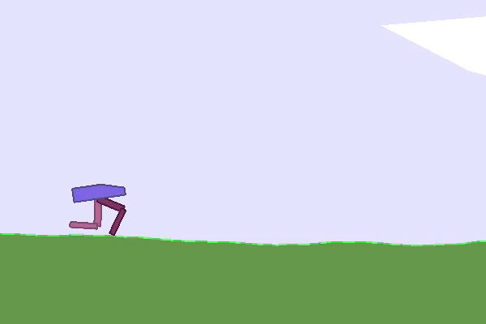
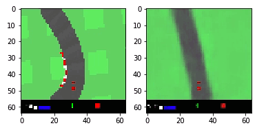

<h2 align="center">

Aprendizaje Reforzado

</h2>

<h2 align="center">

</h2>

## 🆕 Update
- 23/01/21: Modelos agregados: PPO y World Models, se actualizaron las dependencias de las paqueterías de tal forma que no genere conflictos a la hora de ejecutarlos desde Colab. Puedes usar los siguientes entornos con GYM: LunarLander-v2, CarRacing y BipedalWalker-v3.

## ℹ️ Instrucciones
Si desea ver con más detalle la explicación teórica, consulte `main.ipynb`

A continuación se muestran los resultados para el algoritmo PPO:

PPO Discretizado LunarLander-v2 (1200 episodios)           |  PPO Contínuo BipedalWalker-v3 (4000 episodios)
:-------------------------:|:-------------------------:
 |  

También mostramos como se vería la salida del enfoque World Models en el circuito de coches:

  
  
"Reconstuyendo los sueños"

## 👨‍💻 Maintainers
* Cristhian Wiki, Github: [HiroForYou](https://github.com/HiroForYou) Email: csanchezs@uni.pe

## 🙏🏽 Agradecimientos
* Version 0.1:
Este repositorio se baso principalmente en estos artículos de [towardsdatascience](https://towardsdatascience.com/introduction-to-proximal-policy-optimization-tutorial-with-openai-gym-environment-d1d80036e7c2) y [medium](https://medium.com/arxiv-bytes/summary-world-models-b050be1bf2d5) para el enfoque teórico, le recomiendo encarecidamente invierta su tiempo en dichas lecturas, son una buena apuesta!
En cuanto al código, me base en los siguientes repositorios de [pytorch-vae](https://github.com/sksq96/pytorch-vae.git) y [PPO-PyTorch](https://github.com/nikhilbarhate99/PPO-PyTorch.git). Yo solo hice algunas modificaciones a sus implementaciones por cuestiones de incompatibilidades de Pyglet, Gym y Box2D, de tal forma que puedan ejecutarse sin problemas desde Google Colab. 

* Version 0.2:
*Soon*