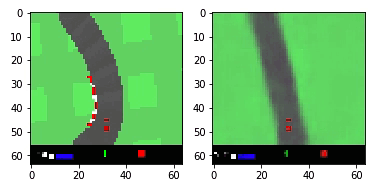
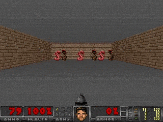
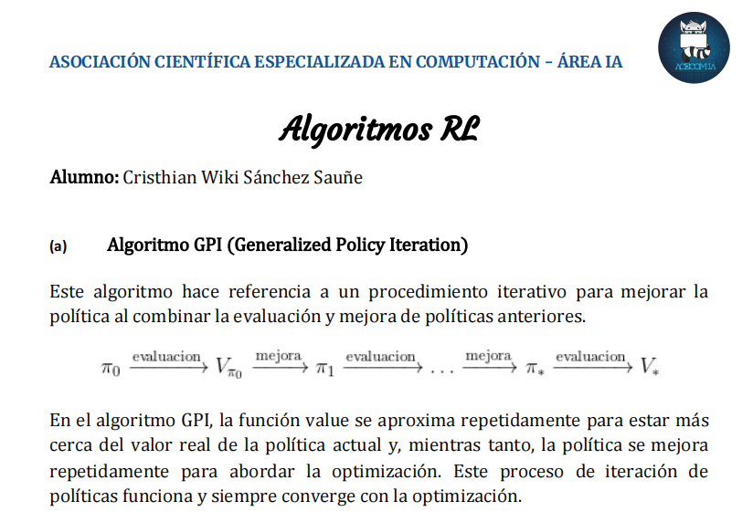

<h2 align="center">

Aprendizaje Reforzado

</h2>

<h2 align="center">

</h2>

## 🆕 Update
- 25/01/21: 

**Modelo DDQN agregado**: Una variante de DQN conocida como Dueling Double DQN ha sido añadida. La arquitectura del modelo consta de algunas capas convolucionales. Se prueba Dueling Double DQN en el entorno GYM de DOOM. 

**Documentación**: Se ha añadido documentación en español respecto a otros algoritmos de RL: SARSA, Actor-Critic, etc.

- 23/01/21: 

**Modelos agregados**: PPO y World Models, se actualizaron las dependencias de las paqueterías de tal forma que no genere conflictos a la hora de ejecutarlos desde Colab. Puedes usar los siguientes entornos con GYM: LunarLander-v2, CarRacing y BipedalWalker-v3.

## ℹ️ Instrucciones
* **PPO y World Models**

Si desea ver con más detalle la explicación teórica de PPO y World Models consulte `main.ipynb` o ejecútelo directamente desde COLAB:

<h2 align="center">

</h2>

A continuación se muestran los resultados para el algoritmo PPO:

PPO Discretizado LunarLander-v2 (1200 episodios)           |  PPO Contínuo BipedalWalker-v3 (4000 episodios)
:-------------------------:|:-------------------------:
 |  

También mostramos como se vería la salida del enfoque World Models en el circuito de coches:

  
  
"Reconstuyendo los sueños"

* **DQN**

Para esta parte me base en el repositorio de [EXJUSTICE](https://github.com/EXJUSTICE). De momento la versión disponible en español es la variante Dueling Double DQN o DDDQN, que logra un rendimiento superior que el enfoque inicial DQN.

Si desea consultar el cuaderno de DDQN, consulte `DQN/DDDQN/Doom-DDDQN-Pytorch.ipynb` o ejecútelo directamente desde COLAB:

<h2 align="center">

</h2>

También mostramos como se vería la salida del enfoque DDDQN dentro del juego DOOM para 2000 episodios:

  
  
DDQN en DOOM

*Nota*: Si usted ejecuta el cuaderno desde COLAB observará un error en la celda de entrenamiento. Hasta el momento de la actualización de este repositorio, no se ha podido fijar el error. He abierto un hilo [issues](https://github.com/EXJUSTICE/Doom_DQN_GC/issues/1) en el repositorio original del que me basé para poder arreglar esto. 

* **Otros**

Para mayor información en español de algunos algoritmos de RL consulte la carpeta `Documents-Theory`. Me basé en el trabajo de [Lilian Weng](https://lilianweng.github.io/lil-log/).

  
  
Mayor información de algunos algoritmos RL

## 👨‍💻 Maintainers
* Cristhian Wiki, Github: [HiroForYou](https://github.com/HiroForYou) Email: csanchezs@uni.pe

## 🙏🏽 Agradecimientos
* Version 0.1:
Este repositorio se baso principalmente en estos artículos de [towardsdatascience](https://towardsdatascience.com/introduction-to-proximal-policy-optimization-tutorial-with-openai-gym-environment-d1d80036e7c2) y [medium](https://medium.com/arxiv-bytes/summary-world-models-b050be1bf2d5) para el enfoque teórico de PPO y World Models, le recomiendo encarecidamente invierta su tiempo en dichas lecturas, son una buena apuesta!
En cuanto al código para PPO y World Models, me base en los siguientes repositorios de [pytorch-vae](https://github.com/sksq96/pytorch-vae.git) y [PPO-PyTorch](https://github.com/nikhilbarhate99/PPO-PyTorch.git). Yo solo hice algunas modificaciones a por cuestiones de incompatibilidades de Pyglet, Gym y Box2D, de tal forma que puedan ejecutarse sin problemas desde Google Colab. 

* Version 0.2:
*Soon*